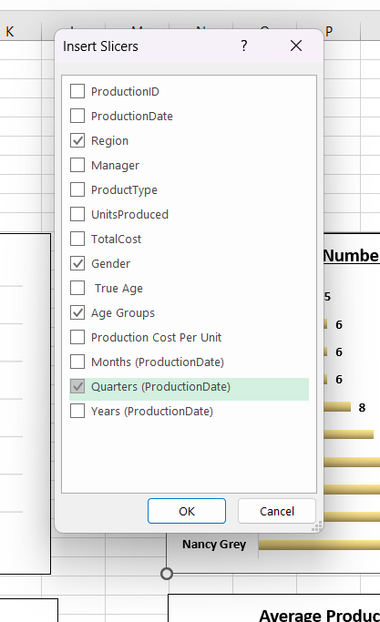
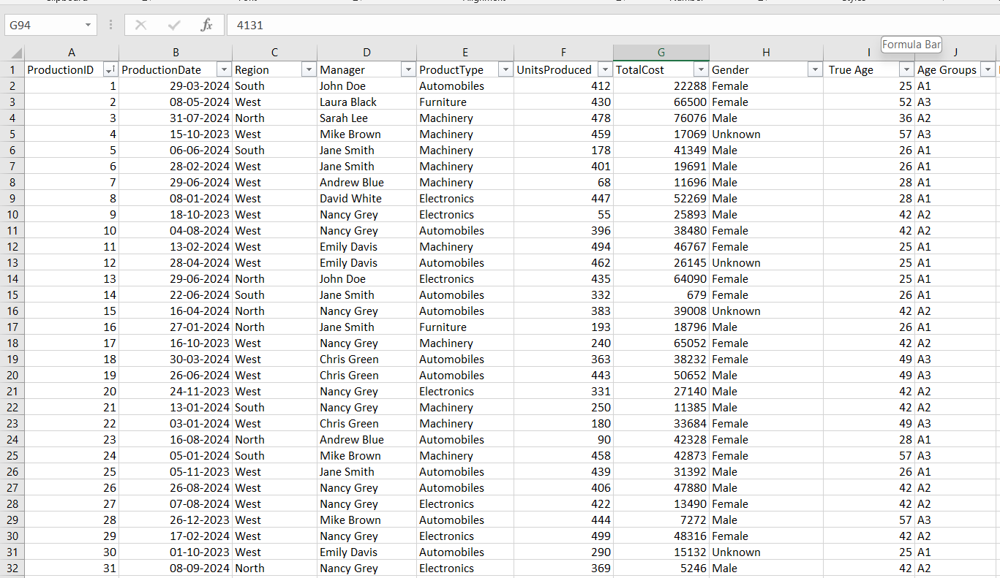
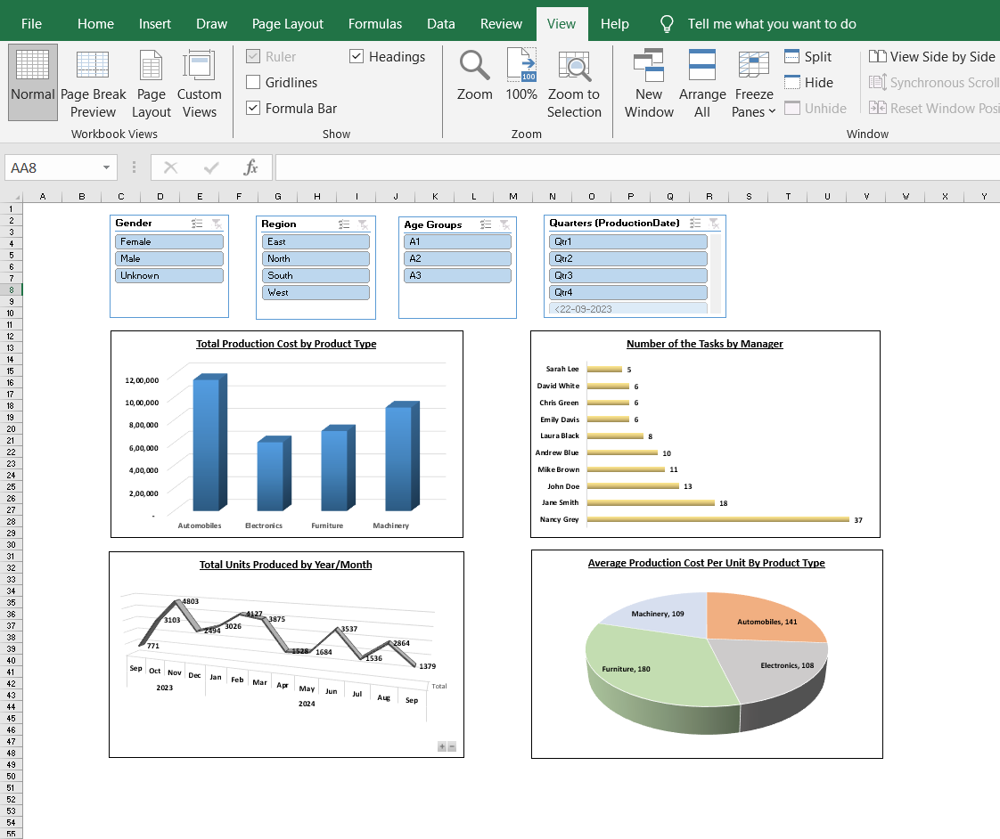
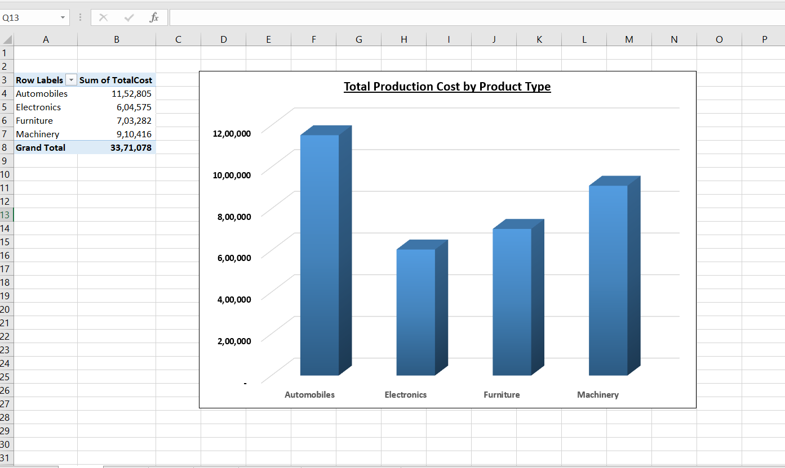
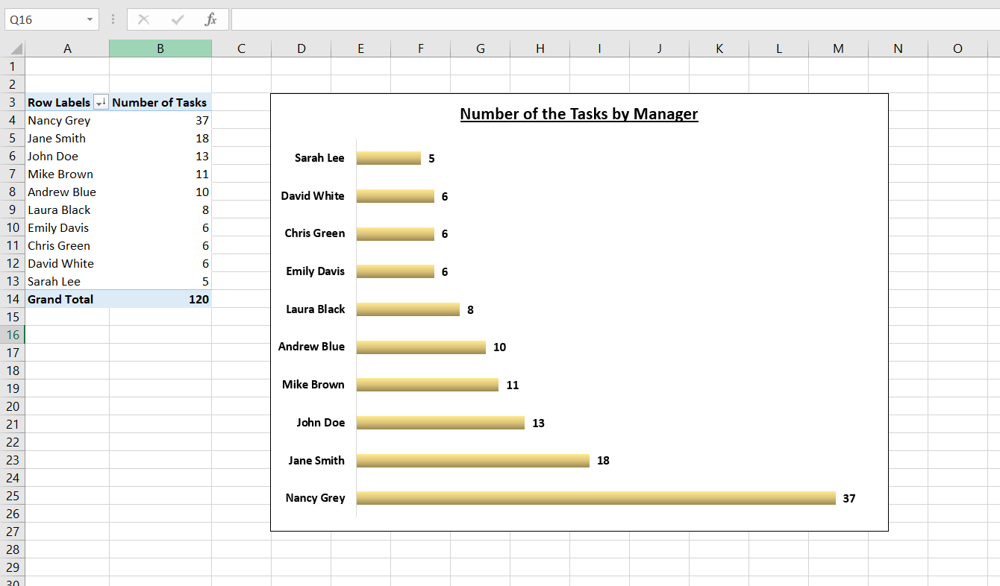
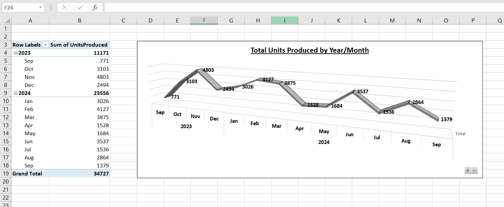
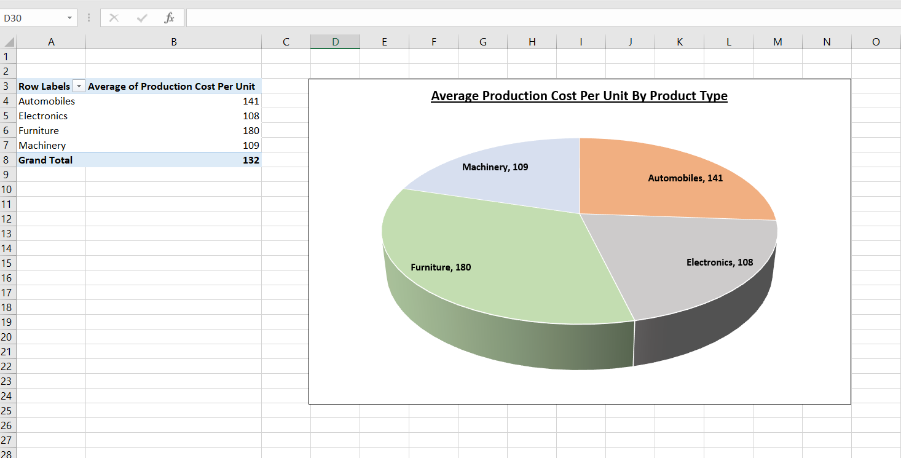

# Production Dataset

## Problem Statement
The production dataset dashboard analyzes a comprehensive production dataset to provide insights into production costs, units produced, task distribution, and manager performance across different regions, product types, and time periods. It helps stakeholders:

- Understand the distribution of production costs and units across product types and regions.
- Identify efficient managers and potential areas for improvement in task allocation.
- Highlight trends in production over time and support data-driven decisions for optimizing production processes through interactive visualizations and filters.

By creating interactive dashboards in Excel, production managers, analysts, and regional supervisors can make informed decisions to enhance efficiency and reduce costs.
## Steps Followed
Step 1: Imported the dataset into Excel and performed initial data cleaning using Excel functions and formulas.

- Added a Production-ID column for unique task identification:
- Inserted a new column and used a formula to generate True Age.

      Updated the True Age column using VLOOKUP:
      =VLOOKUP(D2, Sheet2!$A$1:$B$10,2,0)

- Added an Age_Group column for segmentation:

      Created a new Age_group with the formula:
      =IF(D2<=35,"A1",IF(AND(D2>35,   D2<=45),"A2","A3"))

- Added a Production Cost Per Unit column:

      Created a new column with the formula: =G2/F2

Step 2: Created charts for data visualization:

- Bar chart for Total Production Cost by Product Type.
- Bar chart for Number of Tasks by Manager.
- Line chart for Total Units Produced by Year/Month.
- Pie chart for Average Production Cost Per Unit by Product Type.

Step 3: Applied consistent formatting and colors to enhance readability and professionalism.

Step 4: Ensured all data was validated and cross-checked for accuracy.

Step 5: Inserted slicers for interactive filtering by Gender, Region, Age Groups, and Quarters (ProductionDate).

# Snapshot of Dashboard
### Excel Workbook: 

### Dashboard:

### Pivot 1 - Total Production Cost by Product Type:

### Pivot 2 - Number of Tasks by Manager:

### Pivot 3 - Total Units Produced by Year/Month:

### Pivot 4 - Average Production Cost Per Unit by Product Type:

# Insights
Following inferences can be drawn from the dashboard:
[1] Total Production Cost by Product Type

- Automobiles: Highest cost at ~12,000 units.
- Electronics and Machinery: Moderate costs at ~8,000 and ~6,000 units respectively.
- Furniture: Lowest cost at ~4,000 units.
Suggests a need to optimize costs for high-cost product types like Automobiles.

[2] Number of Tasks by Manager

- Nancy Gray: Highest task count at 18.
- Jane Smith and John Doe: Moderate counts at 13 each.
- Sarah Lee: Lowest count at 5.
Indicates uneven task distribution, with Nancy Gray handling significantly more tasks.

[3] Total Units Produced by Year/Month

- Peak production in October 2023 at 4803 units, with a decline to 1379 units by September 2024.
Shows a seasonal trend with potential drops requiring investigation.

[4] Average Production Cost Per Unit by Product Type

- Machinery: 109 units, lowest cost per unit.
- Furniture: 180 units, moderate cost.
- Automobiles: 141 units, high cost.
- Electronics: 108 units, lowest cost.
Highlights cost efficiency in Electronics and Machinery production.

[5] Overall Production Insights

Regions like North and South show balanced production, while manager performance varies widely. Age groups A1 and A2 dominate, suggesting younger managers are more active.

# Conclusion
The Production Dataset Dashboard provides a detailed view of production metrics, enabling stakeholders to:

- Identify cost-intensive product types and regions for optimization.
- Reallocate tasks among managers for balanced workload.
- Monitor production trends over time to forecast and plan effectively.

This tool supports data-driven strategies to enhance production efficiency and resource management.

--- 
Author - Rajat Singh B.Tech Computer Science And Engineering | Data Analysis Enthusiast Email: rajattsingh10@gmail.com | LinkedIn: https://www.linkedin.com/in/rajat-singh-bb941924a/
